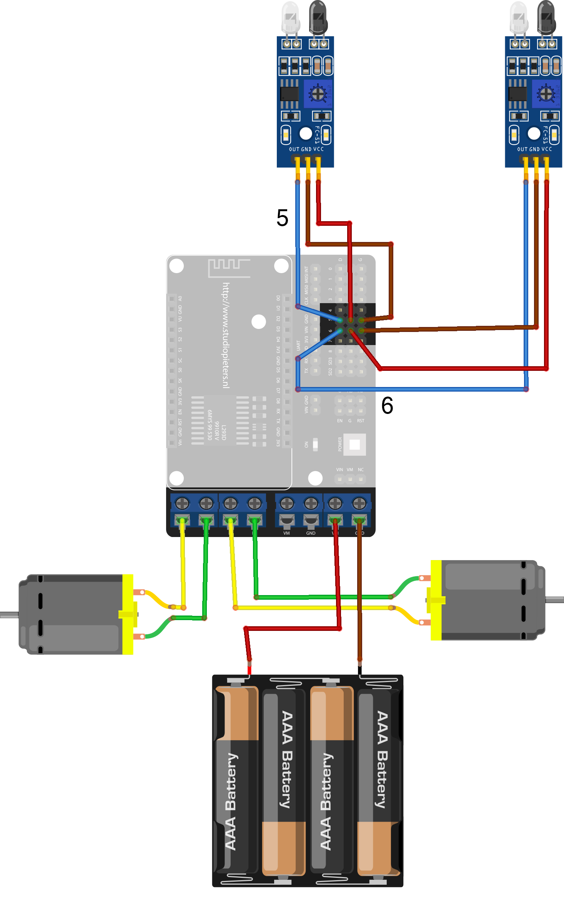

# esp-line-follower
## Purpose
The goal of the project is to teach beginners into robotics without fearing and over-complicated or expensive parts.
It's indended to be open enough for future experiments and improvements.

## Required skills
* Basic soldering skills.
  A few wires need to be soldered here and there, nothing major.
* Some understanding on how electronic components are connected together
  Just enough to know the difference between "+" and "-", signal and power lines, etc.
* Basic knowledge on Arduino IDE and how sketches are uploaded.

## Required parts
This is the minimum list of required parts. Basically, these are the parts which are being used in this project.
The list should not limit you in case if you wish to add some additional functionality or make other experiments based on that.
* Microcontroller board.
  The project uses ESP8266 NodeMCU board with CP2102. Sometimes that board is referenced as "ESP8266 NodeMCU v2 DevKit".
  There are some variations of ESP8266 NodeMCU board with CH340G chip, but these are too wide to fit into motor driver shield and so can't be used.
* Motor driver shield.
  The shield is based on L293DD chip. A single chip contains four half-bridges which can be connected as two full bridges to drive two motors.
* A pair of Reflective Infrared sensor boards.
  These are sometimes called "Obstacles avoiding infrared sensor board". Each board contains an infrared LED and infrared photodiode.
  There are a lot of variations of those boards. I highly recommend to pick those with a small adjustment, this way it can be adjusted according to the current lighting and surrounding contrast.
* 2WD Robot Chassis.
  Normally, the chassis comes with two motors with built-in reductors, 4*AA battery holder and enough screws and mounting hardware to put everything together. You will still need some additional mounting/screws to put your ESP8266, Motor shield and Infrared sensors.

## Bill Of Materials (BOM)
All prices are approximate and depend on the source where you purchase it. My recommended sources are eBay and AliExpress. You can also find it on Amazon, but it tends to be slightly more expensive. All prices are in USD.

Qnty | Part | Cost | Buy
-- | - | - | -
1 | ESP8266 NodeMCU (CP2102) | $5.00
1 | L293DD Motor Shield for ESP8266 NodeMCU | $2.50
2 | Infrared sensors | $1.50
1 | 2WD Robot Chassis | $8.00
1 | Various holders/screws | $2.00

**Total**: about $20

## Connection diagram

